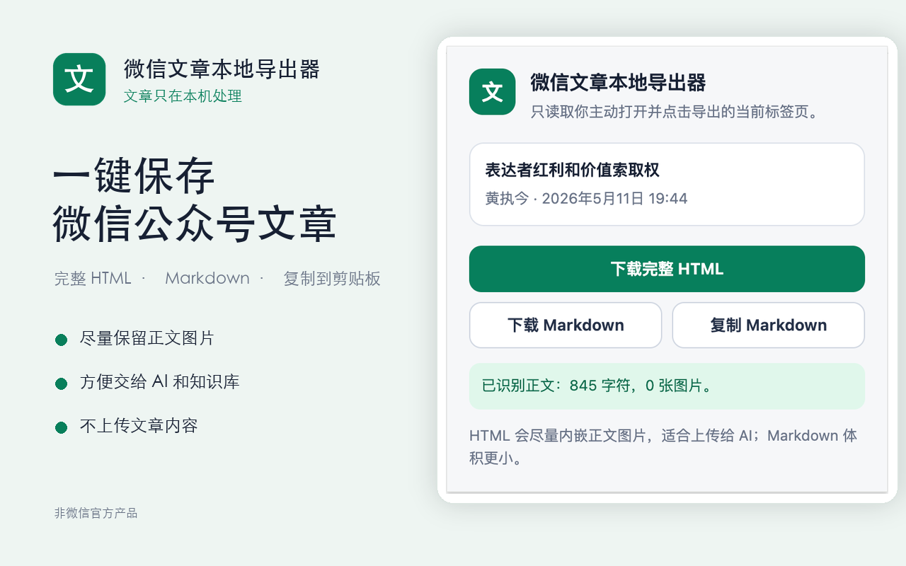

# 微信文章本地导出器

把当前打开的微信公众号文章保存为完整 HTML 或 Markdown。文章只在你的电脑中处理，不会上传到开发者服务器。



## 它能做什么

- **下载完整 HTML**：尽量把正文图片放进同一个文件，适合离线阅读和交给 AI 分析；
- **下载 Markdown**：得到轻量、便于检索和编辑的文本文件；
- **复制 Markdown**：直接粘贴到 AI、笔记或知识库中。

插件只能处理你已经正常打开、并且有权阅读的文章。它不会绕过登录、验证码、付费、删除或其他访问限制。

## 我应该看哪份指南

| 你的目的 | 请看 |
|---|---|
| 第一次使用插件 | [使用说明](docs/USER-GUIDE.md) |
| 收到 ZIP 后手动安装 | [朋友安装指南](docs/FRIEND-INSTALL.md) |
| 查看 Chrome 商店文档总入口 | [Chrome 商店发布文档](docs/WEB-STORE-PUBLISH.md) |
| 以后参考通用上架流程 | [Chrome Web Store 上架通用指南](docs/WEB-STORE-PUBLISH-GENERAL.md) |
| 查看本次首次提交的文案、素材和问题记录 | [v0.1.0 首次提交记录](docs/submissions/2026-09-01-v0.1.0.md) |
| 维护代码和发布新版 | [长期维护指南](docs/MAINTENANCE.md) |
| 了解插件处理原理 | [技术说明](docs/TECHNICAL.md) |
| 查看隐私承诺 | [隐私政策](PRIVACY.md) |

## 两种发行方式

最新发行包下载：<https://github.com/zhijinallin/wechat-article-exporter/releases/latest>

运行 `./scripts/package.sh` 后，会在本机 `dist/` 目录生成：

1. `wechat-article-exporter-v版本号-friends-unpacked.zip`

   发给少量朋友。朋友解压后，通过 Chrome 的“加载未打包的扩展程序”安装。

2. `wechat-article-exporter-v版本号-chrome-web-store.zip`

   上传 Chrome Web Store。建议选择 **Unlisted（非公开）**，让拿到商店链接的人安装并自动更新。

ZIP 和其他发行产物不直接提交进 Git，由 GitHub Release 长期保存。

## 当前版本

- 版本：`0.1.0`
- 状态：已在 Chrome 中重新加载，并由项目所有者于 2026-09-01 确认真正文章可以正常导出。
- Chrome Web Store：项目所有者已于 2026-09-01 提交审核；审核结果待定，尚未确认发布。
- Manifest：V3
- 最低 Chrome 版本：114

## 权限

- `activeTab`：只有用户点击插件后，才临时读取当前标签页；
- `scripting`：在当前文章页面运行正文提取程序；
- `mmbiz.qpic.cn`、`mmbiz.qlogo.cn`：下载微信正文图片，以便放入完整 HTML。

插件不申请 Cookie、浏览历史、密码、调试器、所有网站访问或远程代码权限。

## 项目结构

```text
manifest.json          Chrome 扩展配置
popup.*                插件弹窗和导出逻辑
extractor.js           微信文章提取与清理逻辑
icons/                 插件图标
docs/                  用户、商店和维护指南
store-assets/          商店截图和宣传图片
scripts/               打包与验证脚本
test/                  不访问微信的本地测试页面
```

## 项目主页

长期维护于：<https://github.com/zhijinallin/wechat-article-exporter>

本项目与腾讯、微信或微信公众平台没有隶属、授权或官方合作关系。
