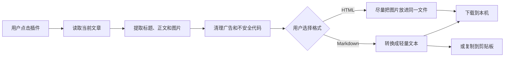

# 技术说明

## 一句话原理

它像一个只在用户点击时工作的“网页复印和重新排版助手”：读取当前文章，去掉无关网页组件，再生成 HTML 或 Markdown 文件。

## 处理链路

1. `popup.js` 检查当前地址是不是微信公众号文章；
2. 用户点击插件后，Chrome 临时允许它访问当前标签页；
3. `extractor.js` 找到标题、公众号、时间和正文；
4. 提取程序复制正文，删除脚本、表单、广告和危险属性；
5. HTML 路线会尝试从两个微信图片域名取得正文图片，并转成 Base64 放进文件；
6. Markdown 路线把标题、段落、列表、引用、链接和图片等转换成 Markdown；
7. 浏览器把结果保存到下载目录，或者写入剪贴板。

## 为什么说它是本地处理

项目没有后端服务器、用户账号、统计 SDK 或远程 AI 接口。插件只和两类对象交互：

- 用户当前已经打开的微信公众号文章；
- 文章本来就在使用的微信图片域名。

文章正文不会发送给开发者。

## 权限和用途

| 权限 | 用途 | 控制范围 |
|---|---|---|
| `activeTab` | 读取当前文章 | 只有用户点击后，对当前标签页临时生效 |
| `scripting` | 运行正文提取程序 | 只注入当前标签页 |
| 微信图片域名 | 把正文图片嵌入 HTML | 仅 `mmbiz.qpic.cn` 和 `mmbiz.qlogo.cn` |

## 已知边界

- 微信调整网页结构后，正文提取规则可能需要更新；
- 单张图片超过 10 MB 或全部图片超过 50 MB 时会跳过部分图片；
- 视频和音频不打包；
- Markdown 会简化复杂排版，表格会保留 HTML；
- 它不能处理用户本来就无法打开的文章。
