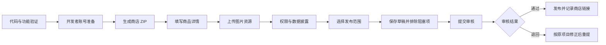

# Chrome Web Store 上架通用指南

适用范围：首次提交或更新 Manifest V3 Chrome 扩展。面向没有开发背景的产品经理，也可作为开发和发布人员的检查清单。

最后核对日期：2026-09-01。Chrome 后台字段和政策可能变化，正式提交时以后台现行提示及文末官方资料为准。

## 先区分四种状态

| 状态 | 含义 |
|---|---|
| 草稿 | 已创建商店项目，仍可继续填写 |
| 可提交 | 所有必填项完成，但还没有送审 |
| 已提交审核 | Google 已收到审核请求，结果尚未产生 |
| 已发布 | 审核通过，并按设定范围提供安装 |

“已提交审核”不能写成“已上架”或“审核通过”。如果审核被拒，应保留拒绝原因，在原项目中修正并重新提交。



## 一、提交前准备

### 1. 产品和代码

- 用一句话说清扩展的单一用途；
- 只申请当前功能真正需要的最小权限；
- 把所有 JavaScript 和 WebAssembly 随扩展一起打包，不加载远程可执行代码；
- 确认 `manifest.json` 使用正确版本号，更新时必须高于商店中的旧版本；
- 完整测试主要流程、失败提示、文件下载和卸载；
- 删除密码、令牌、私钥、个人截图、测试账号和无关开发文件。

### 2. 发布材料

- 商店 ZIP；
- 名称、简短说明、详细说明和单一用途；
- 每项权限的用途说明；
- 数据使用勾选和公开隐私政策；
- 商店图标、至少一张真实截图和小型宣传图；
- 支持网址、项目主页和审核人员测试步骤；
- 准备采用的发布范围：Public、Unlisted 或 Private。

### 3. 证据和隐私

- 保存版本号、Git 提交、ZIP 哈希、素材哈希和提交日期；
- 后台截图如果含邮箱、账号、付款信息、浏览器标签或内部项目，应先脱敏再放入公开仓库；
- 原始未脱敏截图可保存在本机私有证据目录，并明确加入 `.gitignore`。

## 二、准备开发者账号

1. 注册 Chrome Web Store 开发者账号并支付一次性费用；
2. 按 Google 要求完成账号安全验证和两步验证；
3. 打开开发者后台首页：<https://chrome.google.com/webstore/devconsole/>；
4. 点击网页左上角 Chrome Web Store 标志旁的三横线；
5. 进入“账号”“账户”或“设置”（`Account` / `Settings`）；
6. 在“联系邮箱”处添加邮箱，并通过收到的邮件完成验证。

右上角显示的登录账号不等于已经添加并验证的发布者联系邮箱。两者可以相同，但联系邮箱仍需单独验证。

## 三、生成正确的商店 ZIP

ZIP 解压后，`manifest.json` 必须直接位于最外层：

```text
extension.zip
├── manifest.json
├── popup.html
├── popup.js
└── icons/
```

不要形成多余的外层目录：

```text
extension.zip
└── extension-v1/
    └── manifest.json
```

商店 ZIP 只放运行所需文件。不要上传朋友安装版 ZIP、`.crx`、`.pem`、`.key`、测试素材或完整源码仓库。

发布前至少记录：

```text
产品版本：
Git 提交：
ZIP 文件名：
SHA-256：
本地验证结果：
```

## 四、新建或更新商店项目

首次提交：

1. 进入 Developer Dashboard；
2. 点击“新增项目”或 `New item`；
3. 上传商店 ZIP；
4. 立即记录商店项目 ID。

更新版本：

1. 必须进入原来的商店项目；
2. 提高 `manifest.json` 版本号；
3. 上传新的商店 ZIP；
4. 不要新建内容相同的第二个项目，否则会产生新扩展 ID，老用户也收不到自动更新。

## 五、填写商品详情

### 1. 文案原则

- 名称应与 `manifest.json` 一致；
- 简短说明先说结果，不堆关键词；
- 详细说明应覆盖核心功能、使用方式、隐私边界和限制；
- 不声称与第三方平台有官方合作，除非确有授权；
- 不承诺代码尚未实现的功能。

通用模板：

```text
简短说明：
将【用户选择的内容】转换或保存为【输出结果】；【核心隐私或工作方式】。

单一用途：
在用户主动执行【触发动作】后，为【当前对象】完成【唯一核心任务】。
```

### 2. 审核人员测试说明

说明应让陌生审核人员不用猜测即可完成验证：

```text
1. 打开一个公开、稳定且合法访问的测试页面。
2. 执行触发扩展的具体动作。
3. 说明界面应显示什么。
4. 逐一测试核心按钮或结果。
5. 说明是否需要账号、付费、特殊权限或测试凭证。
6. 写清数据是否发送到开发者服务器。
```

## 六、准备图片资源

| 资源 | 常用要求 | 是否必填 |
|---|---:|---|
| 商店图标 | 128×128 PNG；实际图形通常为 96×96，四周各留 16 像素透明边距 | 是 |
| 屏幕截图 | 1280×800 或 640×400；JPEG 或无透明层的 24 位 PNG；至少 1 张、最多 5 张 | 是 |
| 小型宣传图 | 440×280；JPEG 或无透明层的 24 位 PNG | 是 |
| 顶部宣传图 | 1400×560；JPEG 或无透明层的 24 位 PNG | 通常可选 |
| 宣传视频 | YouTube 链接 | 可选 |

图片应做到：

- 使用当前版本的真实界面；
- 展示用户能获得的结果；
- 不使用已废弃版本或无关文章；
- 不出现发布者邮箱、其他浏览器标签、私人文件或测试账号；
- 上传后逐项点击“保存草稿”。

## 七、填写权限说明

后台会根据 `manifest.json` 自动列出权限。每一项都必须回答“为什么当前功能离不开它”。

通用写法：

```text
【权限名】用于【具体用户功能】。仅在【触发条件】下访问【最小范围】，不会用于【容易引起担忧的其他用途】。
```

常见示例：

```text
activeTab：用户点击扩展后，临时访问当前活动标签页；不会被动读取其他标签页。

scripting：在用户当前页面运行随扩展打包的处理函数；不会在后台持续运行。

主机权限：只访问列出的具体域名，用于获取实现核心功能所必需的资源；不应申请所有网站权限来为未来功能预留。
```

出现“主机权限可能导致深入审核”的黄色提示通常只是风险提醒。权限确有必要时，应准确解释，不要为了消除提示而填写虚假内容。

## 八、声明远程代码

只有在所有可执行 JavaScript 和 WebAssembly 都包含在提交的扩展包中时，才选择：

```text
不，我并未使用远程代码
```

普通图片、JSON 或 CSS 数据不等于远程可执行代码；从网络加载并执行 JavaScript/Wasm 才属于远程代码。Manifest V3 原则上要求把可执行代码打包在扩展内。

## 九、填写数据使用

Chrome 对“处理数据”的定义很宽：读取、使用或只在本机处理，也可能需要披露。不能因为“没有上传服务器”就把所有数据类型都取消。

逐项判断：

| 数据类型 | 什么时候通常要勾选 |
|---|---|
| 个人身份信息 | 扩展主动处理使用者姓名、邮箱、账号、证件号等 |
| 身份验证信息 | 处理密码、令牌、Cookie 或登录凭证 |
| 个人通讯 | 处理邮件、短信、聊天或私信 |
| 位置 | 获取地区、IP 定位、GPS 或附近设备信息 |
| 网络记录 | 读取或保存用户访问页面的 URL、域名、标题或访问记录 |
| 用户活动 | 记录、分析或传输点击、滚动、鼠标位置、按键等行为 |
| 网站内容 | 读取页面文字、图片、音视频、链接、表单或页面结构 |

容易误判的情况：

- 网页作者姓名通常属于“网站内容”，不自动等于扩展在收集使用者的个人身份；
- 只处理当前页面并不等于读取完整历史，但如果扩展读取或导出当前 URL，按 Chrome 的宽口径可能仍需披露“网络记录”；
- 仅响应按钮点击不等于收集“用户活动”；只有记录、分析或传输这些行为时才勾选；
- 本地处理仍要披露相应类别。

后台下方的有限用途承诺通常需要全部满足并勾选：

```text
不在获批准用途之外向第三方出售或传输用户数据。
不把用户数据用于与产品单一用途无关的目的。
不把用户数据用于信用评估或放贷。
```

如果其中任何一项并不属实，应先修改产品行为或商业模式，不能直接勾选。

## 十、提供隐私政策

只要扩展处理用户数据，就应提供无需登录即可访问的隐私政策。至少写清：

- 处理哪些数据；
- 为什么处理；
- 是否离开用户设备；
- 会发送给谁；
- 保存多久以及如何删除；
- 每项权限的用途；
- 是否有账号、广告、统计或开发者服务器；
- 联系方式和政策更新方式；
- Chrome Web Store 有限用途承诺。

后台勾选、商店文案、扩展实际行为和隐私政策必须一致。

## 十一、选择发布范围

| 范围 | 用户如何找到 | 适用情况 |
|---|---|---|
| Public | 可在商店搜索 | 面向所有用户公开推广 |
| Unlisted | 搜索不到；拿到链接的人可安装 | 朋友、客户或小范围分发 |
| Private | 仅指定账号或组织 | 内部测试或组织部署 |

三种范围都需要政策审核。Unlisted 不是绕过审核的方式。

## 十二、排查“为什么无法提交”

先点击页面顶部“为什么无法提交？”或类似入口，再按提示逐项处理。每修复一项都要点击“保存草稿”。

| 常见阻塞 | 原因 | 处理方法 |
|---|---|---|
| 缺少图片资源 | 图标、截图或小型宣传图未上传 | 按规定尺寸补齐三项必填图片 |
| 权限说明为空 | 后台检测到 manifest 权限但没有理由 | 按实际代码逐项说明用途和边界 |
| 数据使用未完成 | 数据类别或三项承诺没有完成 | 依据真实行为重新勾选并与隐私政策对齐 |
| 联系邮箱缺失 | 登录邮箱没有自动成为发布者联系邮箱 | 在账号/设置页添加邮箱 |
| 联系邮箱未验证 | 只填了地址，没有点击邮件验证链接 | 发送验证邮件、点击链接并刷新后台 |
| 隐私政策不可访问 | URL 需要登录、指向仓库首页或页面不存在 | 使用直达隐私政策正文的公开 URL |
| 版本重复 | 新 ZIP 的版本号没有提高 | 修改 manifest 版本后重新打包 |
| 草稿未保存 | 已填写字段但后台仍认为缺失 | 在每个页面点击“保存草稿”并刷新 |

## 十三、提交审核并记录

提交前记录：

```text
扩展名称：
版本：
商店项目 ID：
发布范围：
Git 提交：
ZIP 文件名和 SHA-256：
隐私政策 URL：
提交日期：
提交状态：SUBMITTED_FOR_REVIEW
```

审核期间：

- 不要新建相同项目；
- 保留 Google 邮件和后台状态；
- 如果审核要求补充说明，保存原文、回复和时间；
- 未收到批准结果前，不要把状态写成“已发布”。

## 十四、审核通过或退回后

通过后补记：

- 批准日期；
- 实际发布范围；
- 商店安装链接；
- 首个公开版本；
- 审核是否提出附加条件；
- README、发行说明和安装指南是否已更新。

退回后补记：

- 完整拒绝理由；
- 关联政策；
- 代码、文案或素材改动；
- 新版本号和新 ZIP 哈希；
- 重新提交日期。

## 十五、以后更新版本

1. 修改代码和文档；
2. 提高 `manifest.json` 版本号；
3. 更新变更记录；
4. 重新测试、打包和校验；
5. 在原商店项目上传新 ZIP；
6. 复核权限、数据披露和隐私政策是否变化；
7. 提交新版审核；
8. 审核通过后更新版本记录和商店链接。

## 官方资料

- [注册开发者账号](https://developer.chrome.com/docs/webstore/register)
- [设置账号和验证联系邮箱](https://developer.chrome.com/docs/webstore/set-up-account)
- [准备扩展 ZIP](https://developer.chrome.com/docs/webstore/prepare)
- [填写商品详情](https://developer.chrome.com/docs/webstore/cws-dashboard-listing)
- [图片规范](https://developer.chrome.com/webstore/images?csw=1)
- [填写隐私字段](https://developer.chrome.com/docs/webstore/cws-dashboard-privacy)
- [用户数据 FAQ](https://developer.chrome.com/docs/webstore/program-policies/user-data-faq)
- [远程代码说明](https://developer.chrome.com/docs/extensions/develop/migrate/remote-hosted-code)
- [选择发布范围](https://developer.chrome.com/docs/webstore/cws-dashboard-distribution)
- [2026 年隐私与披露政策更新](https://developer.chrome.com/blog/cws-policy-updates-2026)

本项目的实际案例见[微信文章本地导出器 v0.1.0 首次提交记录](submissions/2026-09-01-v0.1.0.md)。
