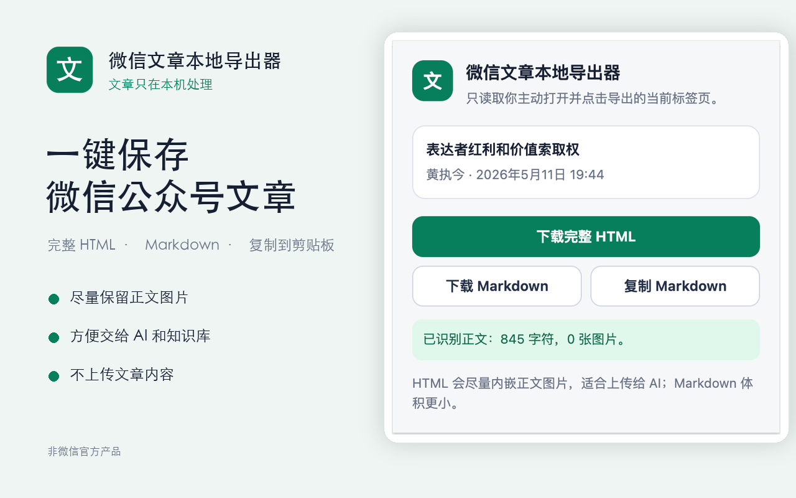
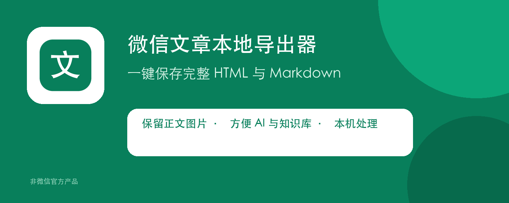

# 微信文章本地导出器 v0.1.0 Chrome Web Store 首次提交记录

记录日期：2026-09-01

> 后续状态更新：项目所有者于 2026-10-04 确认 `v0.1.0` 早已通过审核。本文保留的是 2026-09-01 首次提交时的历史快照，不再代表当前审核状态。现状与待补证事项见[审核通过状态补录](2026-10-04-v0.1.0-review-approved.md)。

## 首次提交时状态（历史快照）

| 项目 | 记录 |
|---|---|
| 扩展名称 | 微信文章本地导出器 |
| 版本 | `0.1.0` |
| Manifest | V3 |
| Chrome Web Store 项目 ID | `cjcmlnmjajhhiaknnpbegnppibkchbgk` |
| 提交状态 | `SUBMITTED_FOR_REVIEW`，项目所有者已确认提请审核 |
| 审核结果 | 2026-09-01 当时尚未获知；后续已由项目所有者确认审核通过 |
| 目标发布范围 | Unlisted（非公开）；提交后应在“分发”页再次核对最终保存值 |
| 代码发行 | [`v0.1.0`](https://github.com/zhijinallin/wechat-article-exporter/releases/tag/v0.1.0) |
| 公开仓库 | <https://github.com/zhijinallin/wechat-article-exporter> |
| 支持网址 | <https://github.com/zhijinallin/wechat-article-exporter/issues> |
| 隐私政策 | <https://github.com/zhijinallin/wechat-article-exporter/blob/main/PRIVACY.md> |

本记录确认的是 2026-09-01 的“已提交审核”。截至该记录时，没有审核通过邮件、商店安装链接或发布完成证据；后续审核通过状态单独补录，不覆盖这份历史证据。

## 一、提交范围和目标

本次提交目标是把 2026-07-30 创建并于 2026-09-01 恢复的本地插件，作为 Chrome Web Store 的 Unlisted 扩展提交审核：

- 拿到商店链接的朋友可以安装；
- 不通过商店搜索公开推广；
- 审核通过后可通过原商店项目自动更新；
- 同时保留“朋友手动安装 ZIP”作为审核期间和小范围测试的备用方式。

## 二、进入商店前完成的工作

### 1. 找回和恢复插件

最初问题：Chrome 工具栏和扩展列表中找不到 2026-07-30 创建的插件。

解决过程：

1. 根据创建日期、插件界面截图和旧对话确认插件身份；
2. 从本地 Git 备份恢复代码；
3. 打开 `chrome://extensions/`；
4. 开启“开发者模式”；
5. 选择“加载未打包的扩展程序”；
6. 重新加载插件目录；
7. 项目所有者确认真实微信公众号文章可以正常识别和导出。

这一步只证明本机手动加载和导出可用，不等于已经完成商店发布。

### 2. 建立两种发行方式

| 用途 | 文件 | 安装方式 |
|---|---|---|
| 朋友手动试用 | `wechat-article-exporter-v0.1.0-friends-unpacked.zip` | 解压后在 `chrome://extensions/` 加载目录 |
| Chrome 商店提交 | `wechat-article-exporter-v0.1.0-chrome-web-store.zip` | 上传 Developer Dashboard |

发行包校验：

```text
8fc5ee2056545f3c08af681b642cb54a64ff6159f124b7d0355e26ab904fba9e  wechat-article-exporter-v0.1.0-friends-unpacked.zip
8e0e9137edb5b0aefe0c780a529111f7b67e25d596d9977694f8360230d24f01  wechat-article-exporter-v0.1.0-chrome-web-store.zip
```

商店上传的是第二个 ZIP。朋友版包含安装说明和外层目录，不能代替商店 ZIP。

### 3. 建立公开长期维护仓库

- GitHub 仓库：<https://github.com/zhijinallin/wechat-article-exporter>
- 首个发行标签：`v0.1.0`
- 商店 ZIP、朋友 ZIP 和 `SHA256SUMS.txt` 已进入 GitHub Release；
- 源代码、隐私政策、用户指南、维护指南和商店素材进入公开仓库；
- `.pem`、`.key`、账号信息和未脱敏后台截图不进入公开仓库。

## 三、开发者账号准备

项目所有者明确确认已完成：

- Google 验证；
- Chrome Web Store 开发者注册费用支付；

提交前后台随后提示发布者联系邮箱缺失且未验证。项目所有者最终能够提请审核，说明该账号阻塞项已被实际消除；但本记录没有单独保存邮箱验证成功页面或验证邮件回执。

联系邮箱问题的关键点：后台右上角显示的 Google 登录邮箱，不会自动被视为已经添加并验证的发布者联系邮箱。

实际解决路径：

1. 返回 Developer Dashboard 首页；
2. 点击网页左上角 Chrome Web Store 标志旁的三横线；
3. 进入“账号/账户/设置”（`Account` / `Settings`）；
4. 添加一个可正常收信的联系邮箱；
5. 点击“验证邮箱”或“发送验证邮件”；
6. 在邮件中点击验证链接；
7. 返回后台刷新，确认状态为已验证。

## 四、商店项目和商品详情

### 1. 商店项目

- 项目 ID：`cjcmlnmjajhhiaknnpbegnppibkchbgk`
- 上传版本：`0.1.0`
- 上传文件：`wechat-article-exporter-v0.1.0-chrome-web-store.zip`
- ZIP 最外层直接包含 `manifest.json`。

### 2. 本次填写的基础信息

截图中实际观察到的后台选项：

```text
名称：微信文章本地导出器
类别：工具
语言：中文（中国）
```

简短说明：

```text
将当前打开的微信公众号文章导出为完整 HTML 或 Markdown；内容只在本机处理。
```

详细说明：

```text
一键保存当前打开的微信公众号文章。

主要功能：
• 下载完整 HTML：尽量把正文图片放进同一个文件，方便离线阅读、归档和 AI 分析；
• 下载 Markdown：生成轻量文本，方便知识库、检索和继续编辑；
• 复制 Markdown：直接粘贴到 AI、笔记或文档中。

隐私保护：
• 只有用户主动点击插件时，才读取当前标签页；
• 文章内容只在用户自己的电脑中处理；
• 不上传文章，不建立账号，不含广告和统计分析；
• 不读取 Cookie、密码或完整浏览历史。

使用边界：
本扩展只能导出用户已经能够正常阅读的文章，不绕过登录、付费、验证码、删除或其他访问限制。视频和音频不会打包。

本扩展与腾讯、微信或微信公众平台没有隶属、授权或官方合作关系。
```

单一用途：

```text
在用户主动点击后，把当前打开且可正常阅读的微信公众号文章导出为本地 HTML 或 Markdown 文件。
```

这些是本次准备并用于提交的文案。由于没有导出后台最终字段快照，后续若后台显示文本与此处不同，应以后台已保存版本补充修订记录，不能静默覆盖本记录。

## 五、审核人员测试步骤

指定测试文章：

<https://mp.weixin.qq.com/s/q1oiEjJ8sPPS5IHm_2M3zg>

提交用测试说明：

```text
1. 使用 Chrome 打开公开文章：
   https://mp.weixin.qq.com/s/q1oiEjJ8sPPS5IHm_2M3zg
2. 等待正文加载完成。
3. 点击工具栏中的“微信文章本地导出器”。
4. 弹窗应显示文章标题、公众号名称和识别到的正文字符数、图片数。
5. 点击“下载 Markdown”，应下载一个 .md 文件。
6. 再次打开弹窗并点击“下载完整 HTML”，应下载一个 .html 文件。
7. 整个过程不要求登录本扩展，也不会把文章发送到开发者服务器。
```

本次真实截图观察到：

```text
标题：表达者红利和价值索取
作者：黄执今
发布时间：2026年5月11日 19:44
正文：845 字符
图片：0 张
```

证据边界：这张截图验证了真实文章识别和导出界面，但文章本身显示 0 张图片，因此不能单独证明多图片内嵌效果。图片处理另由本地测试和代码校验覆盖。

## 六、商店图片资源

上传目录：[`store-assets/upload-ready/`](../../store-assets/upload-ready/README-上传顺序.md)

| 后台字段 | 文件 | 尺寸/格式 | 必填 | SHA-256 |
|---|---|---|---|---|
| 商店图标 | [`01-store-icon-128x128.png`](../../store-assets/upload-ready/01-store-icon-128x128.png) | 128×128 RGBA PNG；图形四周留透明边距 | 是 | `b15aac780e0a3f12f64bd72379a5df00cff50ef3ac0a27d31b9b6982b08e11c1` |
| 屏幕截图 | [`02-screenshot-1280x800.png`](../../store-assets/upload-ready/02-screenshot-1280x800.png) | 1280×800 RGB PNG，无透明层 | 是 | `ed2e14a770e02724e8efae1b15dfd6045bf60762a83a026f2533bc9aae6e4b6f` |
| 小型宣传图块 | [`03-small-promo-440x280.png`](../../store-assets/upload-ready/03-small-promo-440x280.png) | 440×280 RGB PNG，无透明层 | 是 | `c007a80dcdc470da2cdca04b7820c5f866139bbe54c4461a42858d83294148b2` |
| 顶部宣传图块 | [`04-marquee-1400x560-optional.png`](../../store-assets/upload-ready/04-marquee-1400x560-optional.png) | 1400×560 RGB PNG，无透明层 | 可选，已准备 | `312b2b56d0ae04eefe322ba2a24546c703f686668264209683d5ef0cad05f15c` |

商店截图的真实弹窗来源为 [`store-assets/popup-reference.png`](../../store-assets/popup-reference.png)，尺寸 748×756，SHA-256 为 `cf68716f845787e14f7587ea6f4e0f218eeabd1ab3e25792405bcfe002153cab`。该文件用于制作截图，不直接上传为 1280×800 商店截图。

全球宣传视频留空。

主要截图：



小型宣传图：


顶部宣传图：



素材问题及解决：后台最初提示缺少商店图标、屏幕截图和小型宣传图。随后按后台尺寸要求生成三项必填资源和一项可选顶部宣传图，自动校验像素、PNG 类型和透明度，再按编号顺序上传。

## 七、权限说明

`manifest.json` 申请：

```json
{
  "permissions": ["activeTab", "scripting"],
  "host_permissions": [
    "https://mmbiz.qpic.cn/*",
    "https://mmbiz.qlogo.cn/*"
  ]
}
```

本次后台截图已观察到 `activeTab` 和 `scripting` 的以下文字；主机权限当时为空，随后按下述第三段补齐。提交后的最终字段没有导出，因此这里保留“已观察值 + 后续补齐值”，不把未经截图确认的改写版本当成后台原文。

**activeTab**

```text
仅在用户点击扩展时临时读取当前标签页，用于确认当前页面是微信公众号文章并提取用户要求导出的内容。
```

**scripting**

```text
在用户当前打开的文章页面运行正文提取函数，读取标题、作者、发布时间、正文和图片地址。不会在后台持续运行。
```

**主机权限**

```text
仅在用户点击“下载完整 HTML”时，从当前微信公众号文章引用的 mmbiz.qpic.cn 和 mmbiz.qlogo.cn 获取正文图片，并将图片嵌入用户下载的单个 HTML 文件，以便离线查看。权限仅限这两个微信图片域名；请求不携带 Cookie 或其他用户凭证，图片不会上传给开发者或保存到开发者服务器。
```

后台出现“主机权限可能导致深入审核”的黄色提示。处理方式是保留真实需要的最小域名权限并准确说明用途，没有申请所有网站权限，也没有为了消除提示而删掉完整 HTML 的图片功能。

## 八、远程代码声明

选择：

```text
不，我并未使用远程代码
```

选择依据：所有 JavaScript 随扩展 ZIP 一起提供；从两个微信域名获取的是图片数据，不是外部 JavaScript 或 WebAssembly。选择“否”后，下方灰色理由框无需填写。

## 九、数据使用勾选

本次勾选：

```text
✓ 网络记录
✓ 网站内容
```

本次不勾选：

```text
□ 个人身份信息
□ 健康信息
□ 财务和付款信息
□ 身份验证信息
□ 个人通讯
□ 位置
□ 用户活动
```

判断依据：

- 文章文字、图片和超链接属于网站内容；
- 插件读取并写入当前文章标题和原文 URL，因此按 Chrome 的宽口径披露为网络记录；
- 文章作者姓名是被导出的网页内容，不是插件主动收集扩展使用者的姓名或邮箱；
- 插件不读取完整浏览历史，不记录或分析点击、滚动、鼠标位置和按键；
- 即使数据只在本机处理，Chrome 仍要求披露相应类别。

三项有限用途承诺全部勾选：

```text
✓ 不会在已获批准用途之外向第三方出售或传输用户数据
✓ 不会为与产品单一用途无关的目的使用或转移用户数据
✓ 不会为确定信用度或放贷目的使用或转移用户数据
```

隐私政策同步更新，避免后台勾选、公开说明和代码行为不一致。

## 十、发布范围

目标设置：

```text
Visibility: Unlisted
```

Unlisted 代表商店搜索不到，但拿到链接的人可以安装。它仍接受与 Public 相同的政策审核。

证据边界：本次没有保留“分发”页最终保存状态的截图。审核通过或后台状态更新后，应再次核对并在本记录补充最终值。

## 十一、提交过程中遇到的问题和解决方法

| 顺序 | 问题 | 根因 | 解决方法 | 结果 |
|---:|---|---|---|---|
| 1 | Chrome 中找不到插件 | 本地手动加载状态丢失，项目目录未固定为长期入口 | 找回 7 月 30 日项目，从本地 Git 恢复，在 `chrome://extensions/` 重新加载 | 本机恢复可用 |
| 2 | 不清楚“未打包”和“打包”如何分发 | Chrome 手动安装与商店提交使用不同包结构 | 分别生成朋友版 ZIP 和商店 ZIP，并编写两套指南 | 两种发行路径具备 |
| 3 | 官方商店缺必填图片 | 初始项目只有运行图标和弹窗截图，没有符合商店尺寸的完整素材 | 生成 128×128 图标、1280×800 截图、440×280 小型宣传图和可选 1400×560 顶部宣传图 | 图片校验通过并上传 |
| 4 | 不知道如何解释权限 | `activeTab`、`scripting` 和两个微信图片域名需要分别说明 | 按实际调用位置和最小范围填写三段理由，远程代码选择“否” | 权限页完成 |
| 5 | 数据使用勾选容易误判 | “本地处理”仍属于 Chrome 要求披露的数据处理；当前文章 URL 也属于网络记录 | 勾选“网站内容”和“网络记录”，取消“个人身份信息”，三项有限用途承诺全部勾选 | 数据使用页完成 |
| 6 | “无法发布”提示联系邮箱缺失且未验证 | 顶部登录邮箱没有自动成为发布者联系邮箱 | 在账号/设置页添加邮箱、发送验证邮件并点击链接 | 账号阻塞解除 |
| 7 | 提交按钮此前不可用 | 图片、隐私字段和账号要求存在未完成项，且需要保存草稿 | 使用“为什么无法提交？”逐项排除，每页保存草稿 | 项目所有者确认已提请审核 |

## 十二、关键提交和变更链

| Git 提交 | 内容 |
|---|---|
| `70a50e9` | 首次整理代码、隐私政策、发行包、测试和基础商店材料 |
| `3b2a577` / `v0.1.0` | 补充公开 GitHub Release 与商店链接 |
| `a9a36f9` | 补齐并自动校验 Chrome Web Store 图片资源 |
| `465a886` | 完善权限理由和远程代码说明 |
| `3eee549` | 对齐数据使用勾选和公开隐私政策 |
| `3be3b4d` | 增加发布者联系邮箱验证路径 |

这些提交说明材料如何逐步达到可提交状态。后续审核通过结果已在 2026-10-04 状态补录中记录。

## 十三、原始证据和公开边界

本次后台原始截图含发布者邮箱、商店项目标识和浏览器标签，未上传公开 GitHub。原图保存在本机 `private-evidence/2026-09-01-chrome-web-store/`，该目录已被 `.gitignore` 排除并设置为仅本机用户可读。

原始截图哈希：

```text
bcad2fbe5934f02523926c96ebf15c28afd623b4a374269c00ad0afc9f8d5e47  01-missing-store-images.png
ad6834e85c2ef2eed053e88c1e8cd955adf9116fcbe3bf1cf6a1fc12266f22eb  02-permission-justification.png
7c31852371612acb89c4ae207d34f681400d78bb986b6910f8b08e84e3206a90  03-data-usage-checkboxes.png
1220670278630955c2b69ee94cd4eb79b092cd51ed821674329ed0533eac0316  04-contact-email-blocker.png
```

公开仓库只保留不含发布者邮箱的商店图片、具体文案、处理方法和哈希记录。

## 十四、审核结果与后续发布证据

- [x] 项目所有者确认审核通过（2026-10-04 补录；确切批准日期待补）。

- [ ] 记录 Google 批准日期；
- [ ] 记录最终发布范围；
- [ ] 记录 Chrome Web Store 安装链接；
- [ ] 在 README 和朋友安装指南中加入商店安装方式；
- [ ] 验证从全新 Chrome 环境能够安装、打开和导出；
- [ ] 把状态改为 `PUBLISHED`，但只在实际可安装后修改。

通用方法见[Chrome Web Store 上架通用指南](../WEB-STORE-PUBLISH-GENERAL.md)，本项目当前可复制文案见[商店上架文案](../STORE-LISTING.md)。
